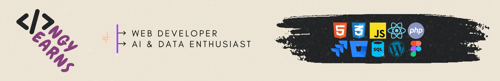
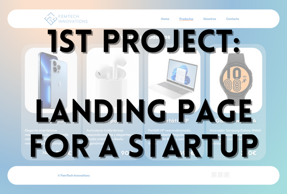
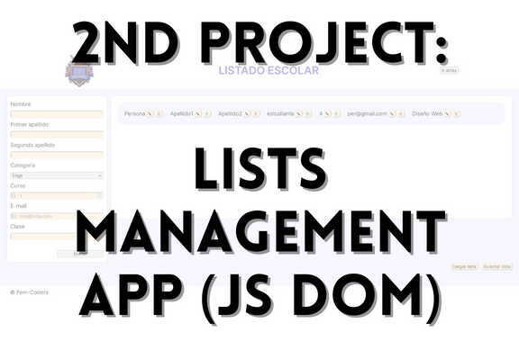
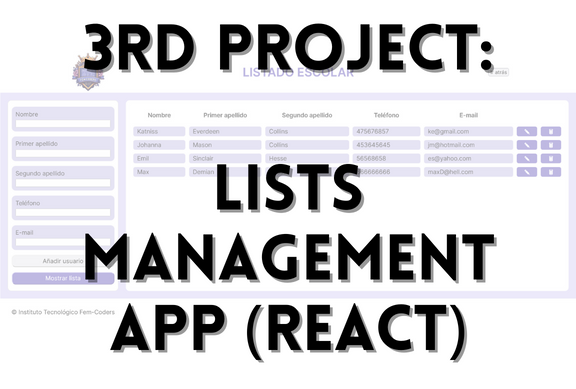
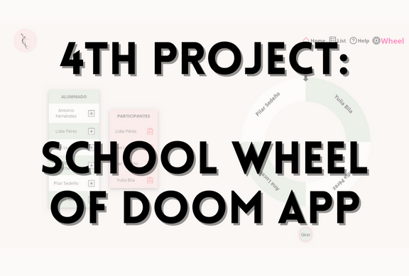

<main class="container">
    <h1>angylearns' ever-growing repositories</h1>
        
    <section>
        Hey there, my name is Angy 🤘 
        Let me introduce you to my most relevant repositories so far (click on them!):   
        <table align="center">
            <tr>
                <td colspan="4" align="center">Bootcamp Full Stack (FemCoders)</td>
            </tr>
            <tr>
                <td></td>
                <td></td>
                <td></td>
                <td></td>
            </tr>
        </table>
        And who am I? What am I? How cool and superhumble am I? 😎
          
        <table align="center">
            <tr>
                <td></td>
                <td align="center">Long-walker • Sarcasm lover • Doubter • Observer •  Eager chips-eater • Inquisitive soul • Ever-changing • Ever-learning</td>
            </tr>
        </table>
        I entered the tech sector during the pandemic and haven't stopped since. I obtained a Professional Certificate in Applications Development with Web Technologies, programmed my first app, and got my first job as a developer. 
          
        I'm currently immersed in my education and professional development. I'm <strong>always</strong> studying!
              
        My world revolves around: 🎶📚✍🏽🧠🖥️📱😀
    </section>
    

    

</main>
