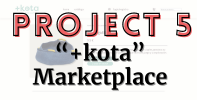

<main class="container">
    <h1>angylearns' ever-growing repositories</h1>
    
    <section>
        Hey there, my name is <strong>Angy</strong> 🤘  
        Let me introduce you to my most relevant repositories so far (click on them!):  
        <table align="center">
            <tr>
                <td colspan="4" align="center"><strong>Full Stack Web Development bootcamp projects</strong></td>
            </tr>
            <tr>
                <td></td>
                <td></td>
                <td></td>
                <td></td>
            </tr>
            <tr>
                <td></td>
                <td></td>
                <td></td>
                <td></td>
            </tr>
        </table> 
        And well... Who am I? What am I? How cool and <strong>superhumble</strong> am I? 😎
          
        <table align="center">
            <tr>
                <td rowspan="4">
                    
                </td>
                <td>Long-walker</td>
                <td>Sarcasm lover</td>
                <td align="center" rowspan="4">
                    My world revolves around:  
                    
                    
                     
                    
                    
                    
                </td>
            </tr>
            <tr>
                <td>Doubter</td>
                <td>Observer</td>
            </tr>
            <tr>
                <td>Eager chips-eater</td>
                <td>Inquisitive soul</td>
            </tr>
            <tr>
                <td>Ever-changing</td>
                <td>Ever-learning</td>
            </tr>
        </table> 
        I entered the tech sector during the pandemic and haven't stopped since. I obtained a <em>Professional Certificate in Applications Development with Web Technologies</em>, programmed my first app, and got my first job as a developer. I had finally discovered that this is my place.
          
        I'm <strong>currently</strong> immersed in my education and professional development. I'm <u>always</u> studying!
          
    </section>
    

     
    

</main>
