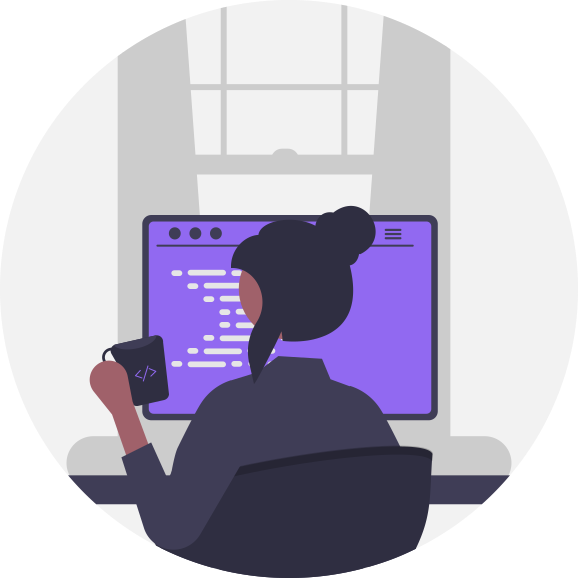

<main class="container">
    <h1>angylearns' ever-growing repository</h1>
    <section>⚠️Right now, I'm <strong>grappling</strong> with this README to get the positioning the way I want it.</section>  
            
            <section>Hi! My name is Angy and I'm a Future Full Stack Developer.
              
            I entered the tech world during the pandemic, and since then, I haven't stopped. I obtained a professional certificate in web application development, programmed my first app, and got my first job as a developer. 
              
            I'm currently immersed in my education and professional development. I <strong>love</strong> learning, and I'm always studying. </section>  
        <table>
            <tr>
                <th>Programming languages I know</th>
                <th>Programming languages I wanna learn</th>
            </tr>
            <tr>
                <td>
                    
                    
                    
                    
                    
                </td>
                <td></td>
            </tr>
        </table>
    </section>
</main>

<!--
**angylearns/angylearns** is a ✨ _special_ ✨ repository because its `README.md` (this file) appears on your GitHub profile.

Here are some ideas to get you started:

- 🔭 I’m currently working on ...
- 🌱 I’m currently learning ...
- 👯 I’m looking to collaborate on ...
- 🤔 I’m looking for help with ...
- 💬 Ask me about ...
- 📫 How to reach me: ...
- 😄 Pronouns: ...
- ⚡ Fun fact: ...
-->
